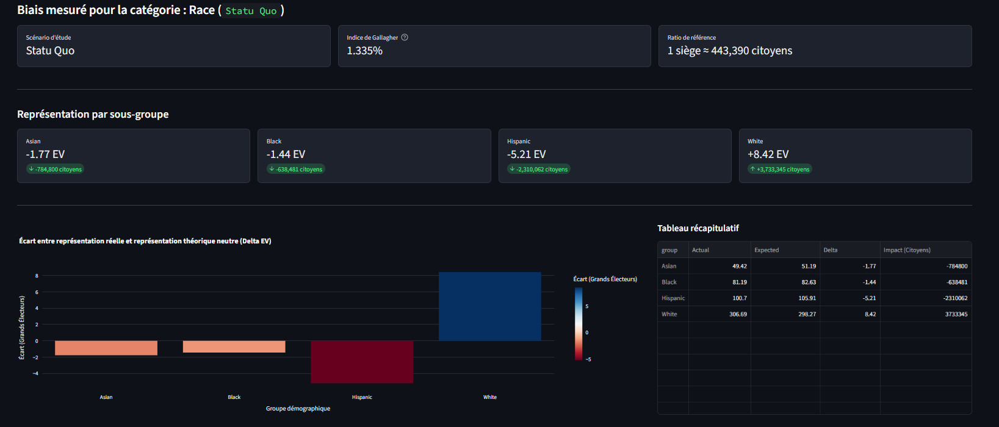
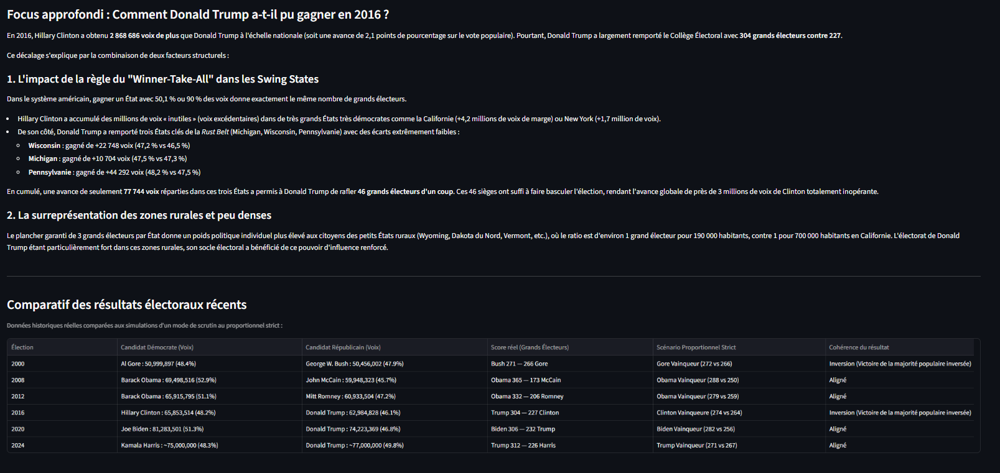
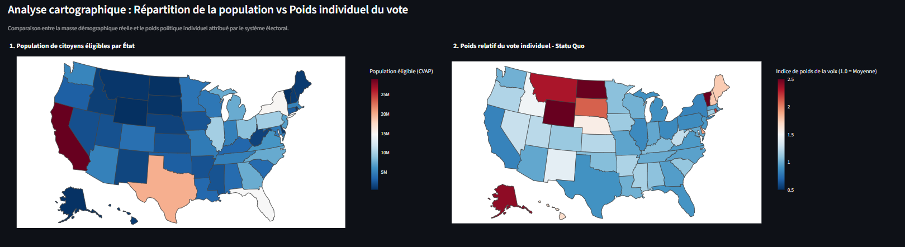
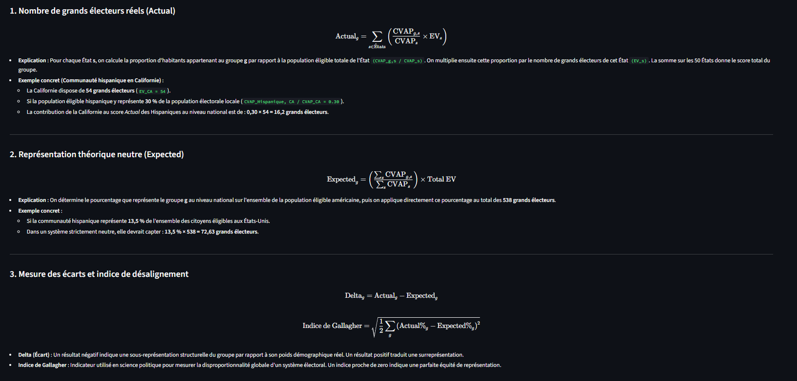

# Analysis of Demographic Bias in the U.S. Electoral College

Une application interactive développée en **Python** et **Streamlit** pour analyser et quantifier le biais de représentation démographique (race, genre, niveau de revenu) induit par le système du Collège Électoral américain.



---

## Vue d'ensemble du Projet

Le Président des États-Unis n'est pas élu au suffrage universel direct, mais via un **Collège Électoral de 538 grands électeurs**. La répartition des sièges par État et l'application majoritaire de la règle du *Winner-Take-All* créent des distorsions démocratiques. 

Ce projet vise à répondre à une question centrale :  
> **Dans quelle mesure la répartition géographique des groupes démographiques aux États-Unis influence-t-elle leur poids politique réel au niveau fédéral ?**

---

## Fonctionnalités Principales

* **Analyse multi-variables** : Évaluation du biais selon la race/origine ethnique, le genre et la tranche de revenu.
* **Simulateur de scénarios** :
  * **Statu Quo** : Système officiel actuel (incluant le plancher de 2 sièges sénatoriaux par État).
  * **Proportionnel Strict** : Allocation des sièges au prorata strict de la population éligible (CVAP).
* **Indicateurs clés** :
  * **Delta EV** : Écart entre le nombre de grands électeurs captés (*Actual*) et la représentation théorique neutre (*Expected*).
  * **Indice de Gallagher** : Mesure synthétique de la disproportionnalité globale de l'élection.
  * **Impact citoyen** : Conversion des écarts de sièges en équivalent de population représentée.



* **Cartographie interactive** : Visualisation choroplèthe comparant la densité de population éligible au poids relatif du vote individuel par État.



* **Explications méthodologiques & cas historiques** : Focus détaillé sur les inversions de résultat (notamment les élections de 2000 et 2016).
* **Mode 100% Hors-Ligne** : Système de cache local évitant toute requête réseau après le premier chargement.

---

## Structure du Projet

```text
us-electoral-college-bias/
├── data/ # Fichiers CSV (CVAP, Revenus, Grands Électeurs)
├── src/
│   ├── bias_calculator.py    # Calcul du biais
│   ├── data_loader.py        # Chargement et préparation des données du Census
│   └── simulator.py          # Moteur de calcul du biais et des métriques
├── app.py                    # Interface utilisateur Streamlit
├── requirements.txt          # Dépendances Python
└── README.md                 # Documentation du projet
```

---

## Méthodologie de Calcul

Le modèle compare la représentation effective d'un groupe démographique à sa valeur théorique équitable :




---

## Installation et Lancement

### Prérequis
* **Python 3.10** ou supérieur.

### 1. Cloner le projet
```bash
git clone https://github.com/yvlovertex/us-electoral-college-bias.git
cd us-electoral-college-bias
```

### 2. Créer et activer un environnement virtuel
* **Sur Windows (PowerShell) :**
  ```powershell
  python -m venv venv
  Set-ExecutionPolicy -Scope Process -ExecutionPolicy RemoteSigned
  .\venv\Scripts\Activate.ps1
  ```
* **Sur macOS / Linux :**
  ```bash
  python3 -m venv venv
  source venv/bin/activate
  ```

### 3. Installer les dépendances
```bash
pip install -r requirements.txt
```

### 4. Lancer l'application Streamlit
```bash
streamlit run app.py
```

L'application s'ouvrira automatiquement dans votre navigateur à l'adresse `http://localhost:8501`.

---

## Technologies Utilisées

* **[Python](https://www.python.org/)** : Langage principal.
* **[Streamlit](https://streamlit.io/)** : Framework pour le développement du tableau de bord interactif.
* **[Pandas](https://pandas.pydata.org/)** & **[NumPy](https://numpy.org/)** : Manipulation et traitement statistique des données.
* **[Plotly Express](https://plotly.com/python/)** : Visualisations graphiques et cartographie choroplèthe.

---

## Source des Données

* **U.S. Census Bureau** : Citizen Voting Age Population (CVAP) Special Tabulation.
* **National Archives (U.S.)** : Représentation officielle du Collège Électoral par État.